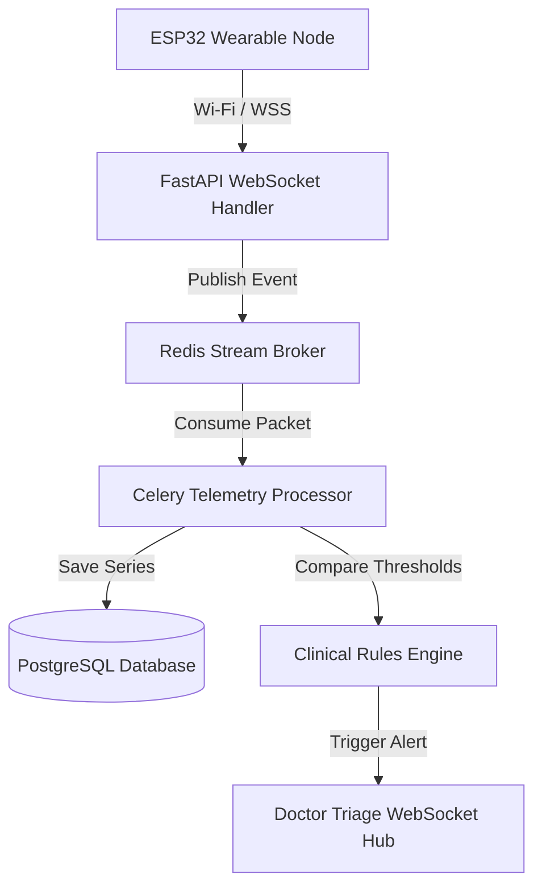

# MEDAI: Full-Stack Backend Architecture Design

This document details the production backend architecture design for the **MEDAI** remote patient monitoring and AI triage platform.

---

## 1. Database Architecture (PostgreSQL Schema)

We recommend using PostgreSQL for its ACID compliance, robust relation constraints, and JSONB capabilities for semi-structured IoT payloads.

```mermaid
erDiagram
    users ||--o| patients : "has one"
    users ||--o| doctors : "has one"
    patients ||--o{ vitals_telemetry : "uploads"
    patients ||--o{ clinical_alerts : "triggers"
    patients ||--o{ referrals : "receives"
    patients ||--o{ appointments : "schedules"
    doctors ||--o{ referrals : "creates"
    doctors ||--o{ appointments : "attends"

    users {
        uuid id PK
        varchar email UNIQUE
        varchar password_hash
        varchar role "patient | doctor | admin"
        timestamp created_at
    }

    patients {
        uuid id PK
        uuid user_id FK
        varchar name
        date dob
        integer health_score
        varchar risk_level "Low | Moderate | High"
    }

    doctors {
        uuid id PK
        uuid user_id FK
        varchar name
        varchar specialty
        integer patients_assigned
    }

    vitals_telemetry {
        bigint id PK
        uuid patient_id FK
        integer heart_rate
        integer spo2
        numeric temperature
        timestamp timestamp INDEX
    }

    clinical_alerts {
        uuid id PK
        uuid patient_id FK
        varchar status "active | resolved"
        varchar risk_level "Moderate | High"
        jsonb triggered_vitals
        text clinician_notes
        timestamp triggered_at
        timestamp resolved_at
    }

    referrals {
        uuid id PK
        uuid patient_id FK
        uuid doctor_id FK
        varchar target_facility
        varchar target_specialty
        varchar status "Pending | In Progress | Completed"
        text notes
        date recommended_at
    }

    appointments {
        uuid id PK
        uuid patient_id FK
        uuid doctor_id FK
        timestamp slot
        varchar status "Scheduled | Completed | Cancelled"
        varchar facility
    }
```

### Key Indexing Strategy
*   `vitals_telemetry (patient_id, timestamp DESC)`: Crucial for rendering real-time dashboard sparklines.
*   `clinical_alerts (status, risk_level)`: Optimizes retrieval for the active doctor triage queue.

---

## 2. FastAPI REST API Specification

### Authentication
*   `POST /api/v1/auth/register`
    *   Registers a new user (patient or doctor profile).
*   `POST /api/v1/auth/token`
    *   Authenticates credentials and returns a secure JWT token.

### Patient Dashboard
*   `GET /api/v1/patient/vitals/latest`
    *   Returns current active telemetry (HR, SpO2, Temp).
*   `GET /api/v1/patient/vitals/history?limit=100`
    *   Retrieves historical vital series for rendering sparklines.
*   `POST /api/v1/patient/appointments`
    *   Books a consultation slot.

### Clinical Triage
*   `GET /api/v1/doctor/triage/queue`
    *   Retrieves active clinical alerts filtered by risk level.
*   `POST /api/v1/doctor/triage/{alert_id}/resolve`
    *   Resolves an alert, registers diagnosis notes, and optionally initiates referrals.
    *   **Body Payload:**
        ```json
        {
          "notes": "Patient reports inhaler relief. Discharged to home monitoring.",
          "verdict": "Approve | Refer | Dismiss"
        }
        ```

### Facility Referrals
*   `GET /api/v1/referrals`
    *   Fetches active referrals for patient/doctor view.
*   `POST /api/v1/referrals/create`
    *   Registers referral details and pushes to target facility queues.

---

## 3. IoT Telemetry Ingestion Pipeline

To handle continuous, high-volume sensor uploads from ESP32 clients (MAX30102 & MLX90614) without blocking web requests, an event-driven ingestion broker is used.



### Ingestion Flow Details
1.  **Handshake:** The ESP32 opens a persistent WebSocket connection to `/api/v1/telemetry/ingress` using an authorized API key header.
2.  **Streaming:** Telemetry is pushed as binary JSON blocks containing `{ hr: 72, spo2: 98, temp: 36.7 }` every 2–4 seconds.
3.  **Buffering:** Redis Streams buffer incoming packets to absorb ingestion spikes.
4.  **Anomaly Detection:** If SpO2 drops below 95% or temperature exceeds 38.0°C twice in a 30-second window, the rules engine writes to the `clinical_alerts` table and pushes a live warning notification to the doctor's active browser.

---

## 4. Machine Learning Inference Pipeline

The symptom assessment feature communicates with a dedicated FastAPI inference worker serving a Python machine learning classifier.

### Input Features Vector
The model evaluates a combined feature set of symptoms and live telemetry snapshots:
1.  `fever_flag` (0 or 1)
2.  `cough_flag` (0 or 1)
3.  `dyspnea_flag` (0 or 1)
4.  `chest_tightness_flag` (0 or 1)
5.  `sensor_hr` (Integer)
6.  `sensor_spo2` (Integer)
7.  `sensor_temp` (Float)

### Inference Workflow
```python
from fastapi import FastAPI, HTTPException
from pydantic import BaseModel
import joblib

app = FastAPI()
model = joblib.load("models/triage_classifier.pkl")

class AssessmentRequest(BaseModel):
    symptoms: list[str]
    hr: int
    spo2: int
    temp: float

@app.post("/api/v1/inference/assess")
def run_inference(data: AssessmentRequest):
    # Construct feature array
    features = [
        1 if "Fever" in data.symptoms else 0,
        1 if "Cough" in data.symptoms else 0,
        1 if "Shortness of breath" in data.symptoms else 0,
        1 if "Chest tightness" in data.symptoms else 0,
        data.hr,
        data.spo2,
        data.temp
    ]
    
    # Classify
    prediction_idx = model.predict([features])[0]
    probabilities = model.predict_proba([features])[0]
    
    labels = ["Healthy / Stable", "Respiratory Tract Infection", "Acute Distress"]
    confidence = float(probabilities[prediction_idx])
    
    return {
        "condition": labels[prediction_idx],
        "confidence": round(confidence * 100, 1),
        "urgency": "High" if prediction_idx == 2 else "Moderate" if prediction_idx == 1 else "Routine"
    }
```
